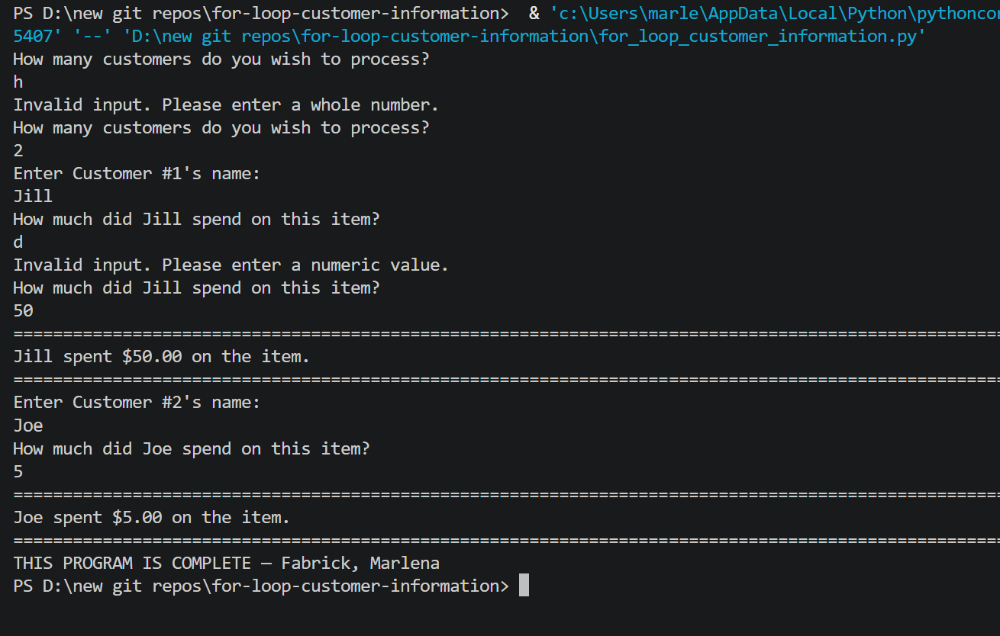

# 🛒 Customer Information Processor — FOR Loop

A Python console program that collects and displays customer purchase information for a set number of customers using a **FOR loop**.

---

## Features

- User enters how many customers to process
- FOR loop runs exactly that many times — no more, no less
- Collects customer name and purchase amount for each customer
- Displays a formatted purchase summary per customer
- Input validation for customer count and purchase amount

---

## How It Works

1. User enters the total number of customers to process
2. A `for` loop using `range()` iterates exactly that many times
3. Each iteration collects a customer name and purchase amount
4. A formatted summary is printed for each customer

---

## Example Output

```
How many customers do you wish to process?
3
Enter Customer #1's name:
Jane Smith
How much did Jane Smith spend on this item?
45.99
====================================================================================================
Jane Smith spent $45.99 on the item.
====================================================================================================
```

---

## Screenshot



---

## FOR Loop vs WHILE Loop

| Feature | FOR Loop (this project) | WHILE Loop |
|---|---|---|
| Number of customers | Known upfront | Unknown — continues until user stops |
| Loop structure | `for count in range(1, how_many+1, 1)` | `while answer == "y"` |
| Control | Automatic via `range()` | Manual via y/Y input |

> See the companion repo `while-loop-customer-information` for the WHILE loop version.

---

## Technologies Used

- Python 3
- `for` loop with `range()` — fixed iteration count
- `format()` — currency formatting with commas
- `try/except` — input validation

---

## Learning Outcomes

- FOR loop syntax and `range(start, stop, step)`
- Processing multiple records with a loop
- Input validation inside a loop
- Formatted currency output

---

## How to Run

1. Make sure Python 3 is installed: https://www.python.org/downloads/
2. Clone or download this repo
3. Open a terminal in the repo folder
4. Run: `python for_loop_customer_information.py`
5. Follow the prompts

---

## Folder Structure

```
for-loop-customer-information/
├── for_loop_customer_information.py
├── output.png
├── README.md
├── LICENSE
└── .gitignore
```

---

## License

This project is licensed under the MIT License — see the [LICENSE](LICENSE) file for details.

---

*Written by Marlena Fabrick — Computer Programming, Fall 2020*
